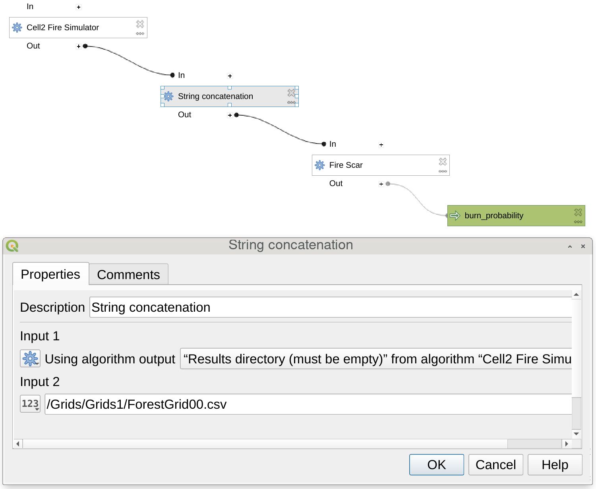

# QGIS Graphical Models

TL;DR: Chain processing algorithms together by using the graphical modeler. Relevant samples attached.

"... When working with a GIS, most analysis operations are not isolated, rather part of a chain of operations. Using the model designer, that chain of operations can be wrapped into a single process, making it convenient to execute later with a different set of inputs. No matter how many steps and different algorithms it involves, a model is executed as a single algorithm, saving time and effort." (taken from QGIS user manual)  

## Samples

1. Simulate & Load All [`SimulateAndLoad.model3`](https://github.com/fire2a/fire-analytics-qgis-processing-toolbox-plugin/raw/main/graphical_models/SimulateAndLoad.model3) __("save link as")__  
This model automates simulating with loading its results to the user interface afterwards. Make sure to:
- Configure the proper layers
- Configure the desired outputs (Propagation DiGraph and Scars can be slow for many or lengthy simulations), 
- There's a special confirmation checkbox to graphically load the Propagation DiGraph because it can get so slow.
- Don't simulate into temporary folders (the model is saved with both helper checkboxes that creates the instance in the project folder, so have a project locally saved)  

2. Risk metrics dependant on Propagation DiGraph [`RiskMetricsDependentOnPropagationDiGraph.model3`](https://github.com/fire2a/fire-analytics-qgis-processing-toolbox-plugin/raw/main/graphical_models/RiskMetricsDependentOnPropagationDiGraph.model3) __("save link as")__  
By simulating with the "Propagation Directed Graph" output option enabled, the simulator writes a "Messages" folder with "MessagesFiles .csv" text-file for each simulation, where each line is an 3-tuple representing an edge weighted by simulation time (from-cell,to-cell,fire-hit-time).

To view this in QGIS use the "Propagation DiGraph" algorithm, that transform each 3-tuple into an arrow in a Vector Layer and also stores the files in a more efficient way (pickled numpy array). This pickled file is then used by both "Betweenness Centrality" and "Downstream Protection Value".  

You can open, configure and run: `RiskMetricsDependentOnPropagationDiGraph.model3` to do this in a pipelined way.  

3. Simulate & Calculate Burn Probability [`SimulateAndBurnProbability.model3`](https://github.com/fire2a/fire-analytics-qgis-processing-toolbox-plugin/raw/main/graphical_models/SimulateAndBurnProbability.model3) __("save link as")__  
This model automates simulating specifically to calculate the Burn Probability metric. Make sure to:
- Configure the proper layers on both algorithms
- Write the correct amount of zeros (same order of magnitude as number of simulations) on the `ForestGrid0...0.csv`

## References
- https://docs.qgis.org/latest/en/docs/user_manual/processing/modeler.html
- https://www.geeksforgeeks.org/whats-data-science-pipeline/
- https://gis.stackexchange.com/questions/329323/qgis3-call-model-from-windows-path-with-python-script
